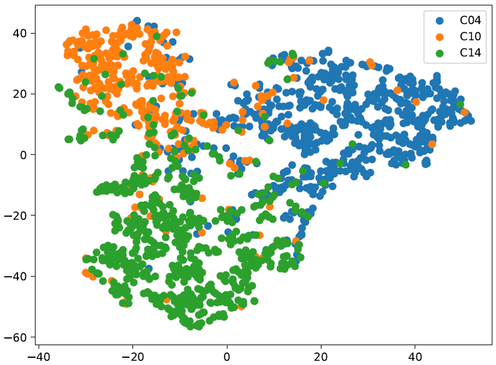

# Text GCN Tutorial

This tutorial (currently under development) is based on the implementation of Text GCN in our paper:

Liang Yao, Chengsheng Mao, Yuan Luo. "Graph Convolutional Networks for Text Classification." In 33rd AAAI Conference on Artificial Intelligence (AAAI-19)


# Require

Python 2.7 or 3.6

Tensorflow >= 1.4.0

# Example input data
The <a href="http://disi.unitn.it/moschitti/corpora.htm">Ohsumed corpus</a> is from the MEDLINE database, which is a bibliographic database of important medical literature maintained by the National Library of Medicine

In this tutorial, we created a subsample of the 2,762 unique diseases abstracts from 3 categories
* C04: Neoplasms
* C10: Nervous System Diseases
* C14: Cardiovascular Diseases

As we focus on single-label text classification, the documents belonging to multiple categories are excluded

1230 train (use 10% as validation), 1532 test

1. `/data/ohsumed_3.txt` indicates document names, training/test split, document labels. Each line is for a document.

2. `/data/corpus/ohsumed_3.txt` contains raw text of each document, each line is for the corresponding line in `/data/ohsumed_3.txt`

# Reproduing Results

1. Run `python remove_words.py ohsumed_3`

2. Run `python build_graph.py ohsumed_3`

3. Run `python train.py ohsumed_3`

# Example output
```
2019-04-04 22:58:26.244395: I tensorflow/core/platform/cpu_feature_guard.cc:141] Your CPU supports instructions that this TensorFlow binary was not compiled to use: SSE4.1 SSE4.2 AVX AVX2 FMA
Epoch: 0001 train_loss= 1.09856 train_acc= 0.41463 val_loss= 1.08209 val_acc= 0.48780 time= 29.13731
Epoch: 0002 train_loss= 1.08044 train_acc= 0.49865 val_loss= 1.05469 val_acc= 0.47967 time= 23.00088
Epoch: 0003 train_loss= 1.05075 train_acc= 0.49865 val_loss= 1.02113 val_acc= 0.47967 time= 21.82401
Epoch: 0004 train_loss= 1.01430 train_acc= 0.49955 val_loss= 0.98582 val_acc= 0.48780 time= 21.42816
Epoch: 0005 train_loss= 0.97174 train_acc= 0.50678 val_loss= 0.95375 val_acc= 0.51220 time= 21.44958
Epoch: 0006 train_loss= 0.93406 train_acc= 0.51220 val_loss= 0.92789 val_acc= 0.55285 time= 24.01502
......
Epoch: 0074 train_loss= 0.01921 train_acc= 0.99819 val_loss= 0.09674 val_acc= 0.96748 time= 24.01229
Epoch: 0075 train_loss= 0.02093 train_acc= 0.99909 val_loss= 0.09715 val_acc= 0.96748 time= 24.08436
Early stopping...
Optimization Finished!
Test set results: cost= 0.24295 accuracy= 0.92167 time= 7.60145
10456
Test Precision, Recall and F1-Score...
             precision    recall  f1-score   support

          0     0.8882    0.8363    0.8614       342
          1     0.9438    0.9517    0.9477       600
          2     0.9174    0.9407    0.9289       590

avg / total     0.9212    0.9217    0.9212      1532

```
# Visualizing Documents
Run `python tsne.py`

# Example Visualization
<!---  --->


